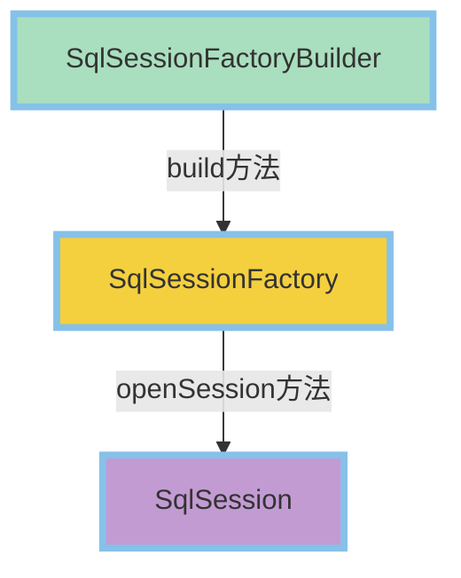

<!-- @import "[TOC]" {cmd="toc" depthFrom=1 depthTo=6 orderedList=false} -->

<!-- code_chunk_output -->

- [框架介绍](#框架介绍)
  - [框架技术](#框架技术)
    - [框架（Framework）](#框架framework)
    - [分析优势](#分析优势)
  - [主流框架](#主流框架)
    - [Struts](#struts)
    - [HIBERNATE](#hibernate)
    - [Spring](#spring)
      - [Spring MVC](#spring-mvc)
    - [MyBatis](#mybatis)
  - [持久化与ORM](#持久化与orm)
- [MyBatis](#mybatis-1)
  - [MyBatis 简介](#mybatis-简介)
  - [搭建 MyBatis 框架](#搭建-mybatis-框架)
    - [编写核心配置文件](#编写核心配置文件)
    - [编写 SQL 映射文件](#编写-sql-映射文件)
    - [编写 JUnit 测试类](#编写-junit-测试类)
  - [MyBatis 与 JDBC 对比](#mybatis-与-jdbc-对比)
  - [MyBatis 基本要素](#mybatis-基本要素)
    - [核心对象](#核心对象)
    - [工具类](#工具类)
    - [SqlSession](#sqlsession)
    - [实践](#实践)
    - [核心配置文件](#核心配置文件)
      - [`configuration`](#configuration)
      - [`properties`](#properties)
      - [`settings`](#settings)
      - [`typeAliases`](#typealiases)
      - [`environments`](#environments)
      - [`mappers`](#mappers)
  - [SQL映射文件](#sql映射文件)
    - [SQL 映射的 XML 文件](#sql-映射的-xml-文件)
      - [`mapper`](#mapper)
      - [`select`](#select)
      - [`resultMap`](#resultmap)
      - [`insert`](#insert)
      - [`update`](#update)
      - [`delete`](#delete)
    - [使用 `resultMap` 实现 高级 结果映射](#使用-resultmap-实现-高级-结果映射)
      - [`association`](#association)
      - [`collection`](#collection)
    - [MyBatis 缓存](#mybatis-缓存)
  - [动态 SQL](#动态-sql)
    - [`if`](#if)
    - [`where`](#where)
    - [`set`](#set)
    - [`trim`](#trim)
    - [`foreach`](#foreach)
    - [`choose`（`when`、`otherwise`）](#choosewhen-otherwise)
    - [MyBatis 入参类型](#mybatis-入参类型)
    - [MyBatis 实现分页功能](#mybatis-实现分页功能)

<!-- /code_chunk_output -->

# 框架介绍

## 框架技术

### 框架（Framework）

- 是一个应用程序的**半成品**提供可重用的公共结构
- 按一定规则组织的一组**组件**

### 分析优势

- 不用再考虑公共问题
- 专心在**业务实现**上
- 结构统一，易于学习、维护
- 新手也可写出好程序

## 主流框架

### Struts

- MVC 设计模式的实现
- 拦截器
- 可变和可重用的标签

### HIBERNATE

- ORM，简化数据库操作
- DAO 层

### Spring

- 依赖注入容器 /AOP 实现
- 声明式事务
- 简化 JavaEE 应用黏合剂，将大家**组装**到一起

#### Spring MVC

- 结构最清晰的 MVC Model2 实现
- 高度可配置，支持**多种**视图技术
- 定制化开发

### MyBatis

- **半自动化**的 ORM 实现
- DAO 层
- 动态 SQL
- 小巧灵活、**简单**易学

## 持久化与ORM

- **持久化**：程序数据在瞬时状态和持久状态间转换的过程
- **ORM**（Object Relational Mapping）：对象-关系映射
  - 👉编写程序的时候，以面向对象的方式处理数据
  - 👉保存数据的时候，却以关系型数据库的方式存储
- ORM 解决方案包含下面四个部分
  - 👉在持久化对象上执行基本的增、删、改、查操作对持久化对象提供一种查询语言或者 API
  - 👉对象关系映射工具
  - 👉提供与事务对象交互、执行检查、延迟加载以及其他优化功能

# MyBatis

## MyBatis 简介

- MyBatis 前身是 iBatis，本是 Apache 的一个开源的项目
- 官方网站
  - 👉[http://mybatis.org（点击以查看）](http://mybatis.org)
- ORM 框架
- 实体类和 SQL 语句之间建立映射关系
- 特点
  - 👉基于 SQL 语法，简单易学
  - 👉能了解底层封装过程
  - 👉SQL 语句封装在配置文件中，便于统一管理与维护，降低程序的耦合度
  - 👉方便程序代码调试

## 搭建 MyBatis 框架

- 使用 **MyBatis** 的开发步骤
- 下载 `mybatis-3.2.2.jar` 包并导入工程
- 编写 MyBatis 核心配置文件（`configuration.xml`）
- 创建实体类：**POJO**
- **<kbd>DAO层</kbd>—<kbd>SQL映射文件</kbd>**（`mapper.xml`）
- 创建**测试类**
  - 👉读取全局(核心)配置文件`mybatis-config.xml`
  - 👉创建`SqlSessionFactory`对象，读取配置文件
  - 👉创建`SqlSession`对象
  - 👉调用`mapper`文件进行数据操作

### 编写核心配置文件

- `mybatis-config.xml`

```xml
<?xml version="1.0" encoding="UTF-8"?>
<!DOCTYPE configuration
PUBLIC "-//mybatis.org//DTD Config 3.0//EN"
"http://mybatis.org//dtd/mybatis-3-config.dtd">
<configuration>
	<!-- 引入database.properties文件 -->
	<properties resource="database.properties"/>
	<settings>
		<setting name="logImpl" value="LOG4J"/>
	</settings>
	<environments default="development">
		<environment id="development">
			<transactionManager type="JDBC"></transactionManager>
			<dataSource type="POOLED">
				<property name="driver" value="${driver}"/>
				<property name="url" value="${url}"/>
				<property name="username" value="${user}"/>
				<property name="password" value="${password}"/>
			</dataSource>
		</environment>
	</environments>
	<!-- 将mapper文件加入到配置文件中 -->
	<mappers>
		<mapper resource="cn/linyer/dao/user/UserMapper.xml"/>
	</mappers>
</configuration>
```

### 编写 SQL 映射文件

```xml
<?xml version="1.0" encoding="UTF-8"?>
<!DOCTYPE mapper
PUBLIC "-//mybatis.org//DTD Mapper 3.0//EN"
"http://mybatis.org//dtd/mybatis-3-mapper.dtd">
<mapper namespace="cn.linyer.dao.user.UserMapper">
	<!--查询用户表的记录数-->
	<select id="count" resultType="int">
		select count(1) as count from users
	</select>
</mapper>
```

### 编写 JUnit 测试类

```java
package cn.linyer.dao.user;
import java.io.IOException;
import java.io.InputStream;
import org.apache.ibatis.io.Resources;
import org.apache.ibatis.session.SqlSession;
import org.apache.ibatis.session.SqlSessionFactory;
import org.apache.ibatis.session.SqlSessionFactoryBuilder;
import org.apache.log4j.Logger;
import org.junit.Before;
import org.junit.Test;
public class UserMapperTest {
	private Logger logger = Logger.getLogger(UserMapperTest.class);
	@Before
	public void setUp() throws Exception {
	}
	@Test
	public void test() {
		String resource="MyBatis-config.xml";
		int count=0;
		SqlSession sqlSession=null;
		try {
			//1 获取mybatis-config.xml的输入流
			InputStream is = Resources.getResourceAsStream(resource);
			//2 创建Sq1SessionFactory
			SqlSessionFactory factory = new SqlSessionFactoryBuilder().build(is);
			//3 创建sqlSession
			sqlSession = factory.openSession();
			//4 调用mapper文件来对数据进行操作，必须将mapper文件引入到mybatis-config.xml中
			count = sqlSession.selectOne("cn.linyer.dao.user.UserMapper.count");
			logger.debug("UserMapperTest count---->"+count);
		} catch (IOException e) {
			e.printStackTrace();
		} finally {
			sqlSession.close();
		}
	}
}
```

## MyBatis 与 JDBC 对比

- JDBC

```java
Class.forName("com. mysql. jdbc. Driver");
Connection connection = DriverManager.getConnection(url, user, password);
String sql = "select count(*) as count from smbms_user";
Statement st = connection.createStatement();
Resultset rs = st.executeQuery(sql);
if(rs.next()){
	int count = rs.getInt("count");
}
```

- MyBatis

```xml
<mapper namespace="cn.linyer.dao.user.UserMapper">
	<select id="count" resultType="int">
		select count(1) as count from smbms_user
	</select>
</mapper>
```

- **优点**
  - 👉与 JDBC 相比，**减少**了 50% 以上的代码量
  - 👉**最简单**的持久化框架、小巧并简单易学
  - 👉SQL 代码从程序代码中彻底**分离**，可重用
  - 👉提供XML标签，支持编写**动态** SQL
  - 👉提供映射标签，支持对象与数据库的 ORM 字段关系映射
- **缺点**
  - 👉SQL语句编写**工作量大**，对开发人员有一定要求
  - 👉数据库**移植性差**
- MyBatis 专注于 SQL 本身，是一个足够灵活的 DAO 层解决方案
- 适用于**性能要求较高**或者**需求多变**的**互联网项目**

## MyBatis 基本要素

- MyBatis 的**核心接口**和**类**
  - 👉`SqlSessionFactoryBuilder`
  - 👉`SqlSessionFactory`
  - 👉`SqlSession`
 - `mybatis-config.xml` 系统核心配置文件
- `mapper.xml` SQL映射文件

### 核心对象



- `SqlSessionFactoryBuilder`
  - 👉用过即丢，其**生命周期**只存在于**方法体内**
  - 👉可**重用**其来创建**多个**`SqlSessionFactory` 实例
  - 👉负责构建`SqlSessionFactory`，并提供**多个**`build`方法的重载

```java
build(InputStream inputStream,String environment,Properties properties)
build(Reader reader,String environment,Properties properties)
build(Configuration config)
```

- 配置信息以三种形式提供给 `SqlSessionFactory` 的 build 方法：
  - 👉`InputStream`（字节流）
  - 👉`Reader`（字符流）
  - 👉`Configuration`（类）
- 读取XML文件构造方式：

```java
String resource = "mybatis-config.xml";
InputStream is = Resources.getResourceAsStream(resource);
SqlSessionFactory sqlSessionFactory = new SqlSessionFactoryBuilder().build(is);
```

- `SqlSessionFactory`

  - 👉`SqlSessionFactory`是**每个** MyBatis 应用的核心
  - 👉作用：创建`SqlSession`实例
    `SqlSession session = sqlSessionFactory.openSession(boolean autoCommit);`

   >`autoCommit`： `true`：关闭事务控制（默认）`false`：开启事务控制

  - 👉作用域：**Application**
  - 👉生命周期与应用的生命周期**相同**
  - 👉单例
    - 👍存在于整个应用运行时，并且同时只存在**一个**对象实例

### 工具类

- 静态代码块，以保证`SqlSessionFactory`只被创建一次
- 创建`MyBatisUtils.java`

```java
package cn.linyer.utils;
import java.io.IOException;
import java.io.InputStream;
import org.apache.ibatis.io.Resources;
import org.apache.ibatis.session.SqlSession;
import org.apache.ibatis.session.SqlSessionFactory;
import org.apache.ibatis.session.SqlSessionFactoryBuilder;
public class MyBatisUtils {
	private static SqlSessionFactory factory;	
	static {		
		try {
			InputStream is = Resources.getResourceAsStream("MyBatis-config.xml");
			factory = new SqlSessionFactoryBuilder().build(is);
		} catch (IOException e) {
			e.printStackTrace();
		}
	}	
	public static SqlSession createSqlSession() {
		return factory.openSession(false);
	}	
	public static void closeSqlSession(SqlSession sqlSession) {
		if(null != sqlSession) {
			sqlSession.clearCache();
		}
	}
}
```

- 测试类

```java
package cn.linyer.dao.user;
import org.apache.ibatis.session.SqlSession;
import org.apache.log4j.Logger;
import org.junit.Before;
import org.junit.Test;
import cn.linyer.utils.MyBatisUtils;
public class UserMapperTest {
	private Logger logger = Logger.getLogger(UserMapperTest.class);
	@Before
	public void setUp() throws Exception {
	}
	@Test
	public void test() {
		int count=0;
		SqlSession sqlSession=null;
		try {
			sqlSession = MyBatisUtils.createSqlSession();
			count = sqlSession.selectOne("cn.linyer.dao.user.UserMapper.count");
			logger.debug("UserMapperTest count---->"+count);
		} catch (Exception e) {
			e.printStackTrace();
		} finally {
			MyBatisUtils.closeSqlSession(sqlSession);
		}
	}
}
```

### SqlSession

- 包含了执行 SQL 所需的**所有**方法
- 对应**一次**数据库会话，会话结束必须**关闭**
- 线程级别，**不能**共享

>- ==关闭`SqlSession`非常重要，必须要确保在`finally`代码块中正常关闭==
>- 在`SqlSession`里可以执行多次SQL语句，但一旦关闭了`SqlSession`就需要重新创建

- `SqlSession`的获取方式

```java
String resource = "mybatis-config.xml";
InputStream is = Resources.getResourceAsStream(resource);
SqlSessionFactory factory = new SqlSessionFactoryBuilder().build(is);
SqlSession sqlSession = factory.openSession();
```

- `SqlSession`的两种使用方式
  - 👉通过`SqlSession`实例直接运行映射的SQL语句
  - 👉基于`Mapper`接口方式操作数据

### 实践

- 非集成环境下的**最佳**实践
  - 👉`SqlSessionFactoryBuilder`
    - 👍用过即丢，推荐作用域在**方法体内**
  - 👉`SqlSessionFactory`
    - 👍最佳作用域范围：**应用**的**全局**作用域
    - 👍生命周期应与应用的生命周期**相同**
  - 👉`SqlSession`
    - 👍线程级
    - 👍一个`request`请求期间

### 核心配置文件

#### `configuration`

- `configuration` 配置 ==**（注意元素节点顺序）**==
  - 👉`properties` 可以配置在 Java 属性配置文件中
  - 👉`settings` 修改 MyBatis 在运行时的**行为方式**
  - 👉`typeAliases` 为 Java 类型命名一个**别名**（简称）
  - 👉`typeHandlers` 类型处理器
  - 👉`objectFactory` 对象工厂
  - 👉`plugins` 插件
  - 👉`environments` 环境
  - 👉`environment` 环境变量
    - 👍`transactionManager` 事务管理器
    - 👍`dataSource` 数据源
  - 👉`mappers` 映射器

#### `properties`

- 配置`properties`元素的两种方式
  1. 👍通过外部指定的方式 **（`database.properties`）**，实现动态配置
  2. 👍直接配置为 **XML**，实现动态配置
- 通过外部指定的方式 **（`database.properties`）**，实现动态配置
  - 👉配置`properties`的`resource`指定

```xml
<properties resource="database.properties"/>
......
<dataSource type="POOLED">
	<property name="driver" value="${driver}"/>
	<property name="url" value="${url}"/>
	<property name="username" value="${user}"/>
	<property name="password" value="${password}"/>
</dataSource>
```

- 直接配置为 **XML**，实现动态配置
  - 👉配置`property`的`name`和`value`

```xml
<properties>
	<property name="driver" value="com.mysql.jdbc.Driver"/>
	<property name="url" value="jdbc:mysql://127.0.0.1:3306/book"/>
	<property name="user" value="root"/>
	<property name="password" value="123456"/>
</properties>
......
<dataSource type="POOLED">
	<property name="driver" value="${driver}"/>
	<property name="url" value="${url}"/>
	<property name="username" value="${user}"/>
	<property name="password" value="${password}"/>
</dataSource>
```

#### `settings`

- 用来修改 MyBatis 运行时的**行为方式**
- 主要是 MyBatis 的一些**全局**配置属性的设置

```xml
<settings>
	<!--是否启用延迟加载-->
	<setting name="lazyLoadingEnabled" value="false"/>
</settings>
```

|设置项|描述|允许值|默认值
|---|---|---|---|
|`cacheEnabled`|对在此配置文件下的所有`cache`进行全局性**开/关**设置|true  / false|true|
|`lazyLoadingEnabled`|全局性设置懒加载。如果设为`false`，则所有相关联的都会被初始化加载|true  / false|true|
|`autoMappingBehavior`|MyBatis对于`resultMap`自动映射匹配级别|NONE / PARTIAL / FULL|PARTIAL|
| ......（9个） | ...... | ...... | ...... |

#### `typeAliases`

- 类型**别名**
- 仅仅只关联 XML 配置，**简写**冗长的 Java 类名

```xml
<typeAliases>
	<typeAlias alias="user" type="cn.smbms.pojo.User"/>
</typeAliases>
```

```xml
<typeAliases>
	<package name="cn.smbms.pojo"/>
</typeAliases>
```

#### `environments`

- 表示配置 MyBatis 的多套运行环境，将 SQL 映射到多个不同的数据库上
- 子元素节点：`environment`，但是**必须**指定其中一个**默认**运行环境（通过`default`指定）

> 每个`SqlSessionFactory`实例只能选择==一个==运行环境

```xml
<environments default="development">
	<environment id="development">
	<transactionManager type="JDBC"/>
		<dataSource type="POOLED">
			<property name="driver" value="${driver}"/>
			<property name="url" value="${url}"/>
			<property name="username" value="${user}"/>
			<property name="password" value="${password}"/>
		</dataSource>
	</environment>
	<environment id="test">
	...
	</environment>
</environments>
```

- `transactionManager`：事务管理器
  - 👉`JDBC` 和 `MANAGED`（托管）

```xml
<transactionManager type="[ JDBC | MANAGED]"/>
```

- `dataSource`
  - 👉`dataSource`元素使用**基本的**`JDBC`数据源接口来配置`JDBC`连接对象的资源
  - 👉有**三种**内建的数据源类型
    - 👍`POOLED`使用**池**的概念

```xml
<dataSource type="[ UNPOOLED | POOLED | JNDI ]">
```

#### `mappers`

- 映射器，定义 SQL 映射语句
- 须在配置中引用`mapper`映射文件
- 方式一：使用**类资源路径**获取资源

```xml
<!--将mapper映射文件加入到系统核心配置文件中-->
<mappers>
	<mapper resource="cn/smbms/dao/user/UserMapper.xml"/>
</mappers>
```

- 方式二：使用 **URL** 获取资源

```xml
<mappers>
	<mapper url="file:///E:/sqlmappers/UserMapper.xml"/>
	<mapper url="file:///E:/sqlmappers/ProviderMapper.xml"/>
<mappers>
```

## SQL映射文件

### SQL 映射的 XML 文件

- MyBatis 真正的强大在于映射语句，专注于SQL，功能强大，SQL映射的配置却是相当简单
- SQL映射文件的几个顶级元素（按照定义的顺序）

|语句|含义|
|---|:---|
|`mapper`|`namespace`命名空间
|`cache`|配置给定命名空间的缓存
|`cache-ref`|从其他命名空间引用缓存配置
|`resultMap`|用来描述数据库结果集和对象的对应关系
|`sql`|可以重用的SQL块，也可以被其他语句引用
|`insert`|映射插入语句
|`update`|映射更新语句
|`delete`|映射删除语句
|`select`|映射查询语句

- **DAO** 层**接口方法**常见的**返回类型**
  - 👉**Java对象**、**Map**、**List** 等复杂数据类型
  - 👉**int**
    - 👍（增、删、改）更新操作时，影响的数据行数
- **MyBatis** 参数入参
  - 👉使用`@Param`注解进行参数的传递
  - 👉封装成**对象**入参

#### `mapper`

- `namespace`：命名空间
  - 👉`namespace`和子元素的`id`联合保证**唯一**，**区别**不同的`mapper`
  - 👉绑定 DAO 接口
    - 👍`namespace`的命名必须跟某个**接口**同名
    - 👍接口中的**方法**与映射文件中 SQL 语句`id`一一对应

```xml
<mapper namespace="cn.smbms.dao.user.UserMapper">
	<select id="getUserList" ...>
		......
	</select>
</mapper>
```

#### `select`

- `select`是 MyBatis 中最常用的元素之一
- `select`语句有很多属性可以详细配置**每一条**语句
  - 👉`id`
    - 👍命名空间中**唯一**的标识符
    - 👍接口中的方法与映射文件中的 SQL 语句`id`一一对应
  - 👉`parameterType`
    - 👍传入 SQL 语句的**参数类型**的**完全限定名**或**别名**
    - 👍基础数据类型
      - 🤜`int`、`String`、`Date`等
      - 🤜只能传入一个，通过`#{参数名}`即可获取传入的值
    - 👍复杂数据类型
      - 🤜**Java 实体类**、**Map** 等
      - 🤜通过`#{属性名}`或者`#{Map的key}`即可获取传入值
  - 👉`resultType`
    - 👍SQL 语句返回值类型的**完整类名**或**别名**

```xml
<select id="getUserListByUserName" parameterType="string" resultType="user">
	select * from users where userName
		like CONCAT ('%',#{userName},'%')
</select>
```

>1. ❗支持==基础数据类型==和==复杂数据类型==❗
>2. ❗大小写==不==敏感❗

- 参数传递：`#{参数名}`

JDBC 代码：

```java
string sql = "select * from users where userName like CONCAT ('%',?,'%')";
PreparedStatement ps = conn.prepareStatement(sql);
ps.setString(1,userName);
```

- >注意❗：数据库字段名与 **JavaBean** 的属性名一致❗

#### `resultMap`

- 描述如何将结果集映射到 Java 对象

```xml
<resultMap type="User" id="userList">
	<result property="id" column="id"/>
	<result property="userCode" column="userCode"/>
	<result property="userName" column="userName"/>
	<result property="userRole" column="userRole"/>
	<result property="userRoleName" column="roleName"/>
</resultMap>

<select id="getUserList" resultMap="userList" parameterType="User">
	select u.*,r.roleName
		from smbms_user u,smbms_role r
		where u.userName like CONCAT('%',#{userName},'%')
		and u.userRole=#{userRole} and u.userRole=r.id
</select>
```

```
<select id="getUserList" 👉resultMap👈="userList" parameterType="User">
            ❗❗一个外部 resultMap 👆 的id，表示返回结果映射到哪一个resultMap❗❗
========================================================================             
<result property="userRoleName" column=👉"roleName"👈/>         
                  ❗❗ 从数据库中查询的列名或者别名 👆      ❗❗
```

- `resultMap` 对比 `resultType`
  - 👉`resultType`：**直接**表示返回类型
    - 👍**基础**数据类型
    - 👍**复杂**数据类型
  - 👉`resultMap`：对外部`resultMap`的**引用**
    - 👍应用场景
      - 🤜数据库字段信息与对象属性**不一致**
      - 🤜**复杂**的联合查询，**自由**控制映射结果
  - 👉二者**不能同时**存在，本质上都是`Map`数据结构🤙
- `resultMap`自动映射匹配前提：**字段名**与**属性名**一致
- `resultMap`的自动映射级别（`autoMappingBehavior`）
  - 👉`PARTIAL`（默认）：自动匹配**所有**属性

```xml
<settings>
	<setting name="autoMappingBehavior" value="NONE"/>
</settings>
```

#### `insert`

- `id`
- `parameterType`

>注意：`insert`、`update`、`delete`元素均 ==**没有**== `resultType`属性

```xml
<insert id="add" parameterType="User">
	insert into smbms_user(userCode,userName,userPassword)
	values(#{userCode),#{userName),#{userPassword))
</insert>
```

#### `update`

- `id`
- `parameterType`

对象入参

```xml
<update id="modify" parameterType="User">
	update smbms_user
	set userCode=#{userCode},userName=#{userName},userPassword=#{userPassword)
	where id=#{id)
</update>
```

多参数入参

```java
public interface UserMapper {
	public int updatePwd(@Param("id")int id,@Param("password")String password);
}
```

```xml
<update id="updatePwd">
	update users
	set password=#{password}
	where id=#{id}
</update>
```

#### `delete`

- `id`
- `parameterType`

```xml
<delete id="deleteUserByld" parameterType="int">
	delete from smbms_user
	where id=#{id}
</delete>
```

### 使用 `resultMap` 实现 高级 结果映射

- `resultMap`属性
  - 👉`id`：**resultMap**的唯一标识
  - 👉`type`：**Java** 实体类
- `resultMap`子元素
  - 👉`id`：一般对应数据库中该行的**主键 id**，设置此项可提高 **MyBatis 性能**
  - 👉`result`：映射到 **JavaBean** 的某个 **“简单类型”属性**
  - 👉`association`：映射到 **JavaBean** 的某个 **“复杂类型”属性**，比如 **JavaBean类**
  - 👉`collection`：映射到 **JavaBean** 的某个 **“复杂类型”属性**，比如 **集合**

#### `association`

- **复杂**的类型关联，==**一对一**==
- 内部嵌套
  - 👉映射一个嵌套 **JavaBean 属性**
- 属性
  - 👉`property`：映射数据库列的实体对象的**属性**
  - 👉`javaType`：**完整 Java 类名**或者**别名**
  - 👉`resultMap`：引用外部 `resultMap`
- 子元素
  - 👉`id`
  - 👉`result`
    - 👍`property`：映射数据库列的实体对象的**属性**
    - 👍`column`：**数据库列名**或者**别名**

```xml
<resultMap type="User" id="userRoleResult">
	<id property="id" column="id"/>
	<result property="userCode" column="userCode"/>
	<result property="userName" column="userName"/>
	<result property="userRole" column="userRole"/>
	<association property="role" javaType="Role">
		<id property="id" column="r_id"/>
		<result property="rolecode" column="rolecode"/>
		<result property="roleName" column="roleName"/>
	</association>
</resultMap>

<select id="getUserlistByRoleId" parameterType="Integer" resultMap="userRoleResult">
	select u.*,r.id as r_id,r.roleCode,r.roleName
	from smbms_user u,smbms_role r
	where u.userRole=#{userRole} and u.userRole=r.id
</select>
```

#### `collection`

- **复杂**类型集合，==**一对多**==
- 内部嵌套
  - 👉映射一个**嵌套结果集**到一个**列表**
- 属性
  - 👉`property`：映射数据库列的实体对象的**属性**
  - 👉`ofType`：**完整 Java 类名**或者**别名**（集合所包括的类型）
  - 👉`resultMap`：引用外部`resultMap`
- 子元素
  - 👉`id`
  - 👉`result`
    - 👍`property`：映射数据库列的实体对象的**属性**
    - 👍`column`：**数据库列名**或者**别名**

```xml
<resultMap type="Address" id="addressResult">
	<id property="id" column="a_id"/>
	<result property="contact" column="contact"/>
	<result property="addressDesc" column="addressDesc"/>
	<result property="postcode" column="postcode"/>
	<result property="tel" column="tel"/>
</resultMap>

<resultMap type="User" id="userAddressResult">
	<id property="id" column="id"/>
	<result property="usercode" column="usercode"/>
	<result property="userName" column="userName"/>
	<collection property="addresslist" ofType="Address" resultMap="addressResult"/>
</resultMap>

<select id="getAddresslistByUserId" resultMap="userAddressResult" parameterType="Integer">
	select u.*,a.id as a_id,a.contact,a.addressDesc,a.tel,a.postcode
	from smbms_user u,smbms _address a
	where u.id=a.userId and u.id=#{id}
</select>
```

- `resultMap`自动映射（`autoMappingBehavior`）的三个匹配级别
  - `NONE`：禁止自动匹配
  - `PARTIAL`（**默认**）：自动匹配所有属性，内部嵌套除外
  - `FULL`：自动匹配所有

### MyBatis 缓存

- 一级缓存
- 二级缓存的配置
  -  MyBatis 的全局`cache`配置
- 第一种：在 MyBatis XML 中配置

```xml
<settings>
	<setting name="cacheEnabled" value="true"/>
</settings>
```

- 第二种：在 Mapper XML 文件中设置缓存，默认情况下：**未开启**

```xml
<cache eviction="FIFO" flushlnterval="60000" size="512" readOnly="true"/>
```

- 在 Mapper XML 文件配置支持`cache`后，若需要对个别查询进行调整，可以单独设置`cache`

```xml
<select id="selectAll" resultType="Emp" useCache="true">
```

## 动态 SQL

- 基于 OGNL 表达式
- 使用动态 SQL 完成**多条件查询**等逻辑实现
- 用于实现动态 SQL 的**元素**主要有
  - 👉`if`
  - 👉`trim`
  - 👉`where`
  - 👉`set`
  - 👉`choose`（`when`、`otherwise`）
  - 👉`foreach`

### `if`

```xml
<select id="getUserList" resultMap="userlist">
	select u.*,r.roleName from smbms_user u,smbms_role r
	where u.userRole=r.id
	<if test="userRole!=null">
		and userRole=#{userRole}
	</if>
	<if test="userName!=null and userName!=''">
		and userName like CONCAT('%',#{userName},'%')
	</if>
</select>
```

### `where`

- 简化 SQL 语句中`where`条件判断
- 智能处理`and`和`or`

```xml
<select id="getUserlist" resultType="User">
	select * from smbms_user
	<where>
		<if test="userName!=null and userName!=''">
			and userName like CONCAT('%',#{userName},'%')
		</if>
		<if test="userRole!=null">
			and userRole=#{userRole}
		</if>
	</where>
</select>
```

### `set`

```xml
<update id="modify" parameterType="user">
	update smbms_user
	<set>
		<if test="usercode!=null">userCode=#{userCode},</if>
		<if test="userName!=nulL">userName=#{userName},</if>
		<if test="userPassword!=null">userPas sword=#{userPassword},</if>
		<if test="gender!=null">gender=#{gender},</if>
		<if test="birthday !=null">birthday=#{birthday},</if>
		<if test="phone!=nulL">phone=#{phone},</if>
		<if test="address!=null">address=#{address},</if>
		<if test="userRolel!=null">userRole=#{userRole},</if>
		<if test="userCode!=nulL">modifyBy=#{modifyBy},</if>
		<if test="userCode !=nulL">modifyDate=#{modifyDate},</if>
	</set>
	where id=#{id}
</update>
```

### `trim`

- 属性
  - 👉`prefix`
  - 👉`suffix`
  - 👉`prefixOverrides`
  - 👉`suffixOverrides`
- 更灵活的去除**多余**关键字
- 替代`where`

```xml
<select id="getUserlist" resultType="User">
	select * from smbms_user
	<trim prefix="where" prefixoverrides="and / or">
		<if test="userName!=null and userName!=''">
			and userName like CONCAT('%',#{userName},'%')
		</if>
		<if test="userRole!=null">
			and userRole=#{userRole}
		</if>
	</trim>
</select>
```

```xml
<update id="modify" parameterType="User">
	update smbms_user
	<trim prefix="set" suffixOverrides="," suffix="where id=#{id}">
		<if test="userCode!=null">userCode=#{userCode},</if>
		<if test="userName!=null">userCode=#{userName },</if>
		<if test="userPassword!=null">userPassword=#{userPassword },</if>
	</trim>
</update>
```

### `foreach`

- 迭代一个**集合**，通常用于`in`条件
- 属性
  - 👉`item`别名
  - 👉`index`位置
  - 👉`collection`：必须指定
    - 👍`list`
    - 👍`array`
    - 👍`map-key`
  - 👉`open`开始符号
  - 👉`separator`间隔符号
  - 👉`close`结束符号

单参数入参：

```xml
<resultMap type="User" id="userMapByRole">
	<id property="id" column="id"/>
	<result property="userCode" column="userCode"/>
	<result property="userName" column="userName"/>
</resultMap>

<select id="getUserByRoleId_foreach_array" resultMap="userMapByRole">
	select * from smbms_user where userRole in
	<foreach collection="array" item="roleIds" open="(" separator="," close=")">
		#{roleIds}
	</foreach>
</select>
```

多参数入参：

```java
public List<User> getUserByConditionMap_foreach_map(Map<String,Object> conditionMap);
```

```xml
<select id="getUserByConditionMap_foreach_map" resultMap="userMapByRole">
	select * from smbms_user where
	gender=#{gender}
	and userRole in
	<foreach collection=" roleIds" item="roleMap" open="(" separator="," close=")">
		#{roleMap}
	</foreach>
</select>
```

### `choose`（`when`、`otherwise`）

- 相当于**Java**中`switch`语句
- 当`when`有条件满足的时候，就跳出`choose`

```xml
<choose>
	<when test="条件1">...</when>
	<when test="条件2">...</when>
	<when test="条件3">...</when>
	...
	<otherwise>...</otherwise>
</choose>
```

### MyBatis 入参类型

- 基本类型
  - `key`：变量名
  - `value`：变量值
- 数组
  - `key`："array"
  - `value`：该数组
- 对象
  - `key`：对象的属性名键值不变
  - `value`：对象的属性值
- `List`
  - `key`: "list"
  - `value`：该List
- `Map`
  - 键值不变

> ❗❗ ==**无论**== 入参是何种类型，MyBatis 都会将其放入在一个 ==**Map**== 中❗❗

### MyBatis 实现分页功能

- 分页—DAO层实现
  - `limit`（起始位置，页面容量）
- 查询用户列表的方法增加2个参数：
  - `from`
  - `pageSize`

```java
public List<User> getuserList(@Param("userName")string userName,
							  @Param("userRole")Integer roleId,
							  @Param("from")Integer currentPageNo,
							  @Param("pagesize")Integer pagesize);
```

```xml
<select id="getUserlist" resultMap="userlist">
	select u.* from smbms user_u, smbms_role r
	where u.userRole=r.id
	<if test="userName!=null and userName!=''">
		and userName like CONCAT('%',#{userName},'%')
	</if>
	<if test="userRole!=null">
		and userRole=#{userRole}
	</if>
	order by creationDate DESC limit #{from},#{pageSize}
</select>
```